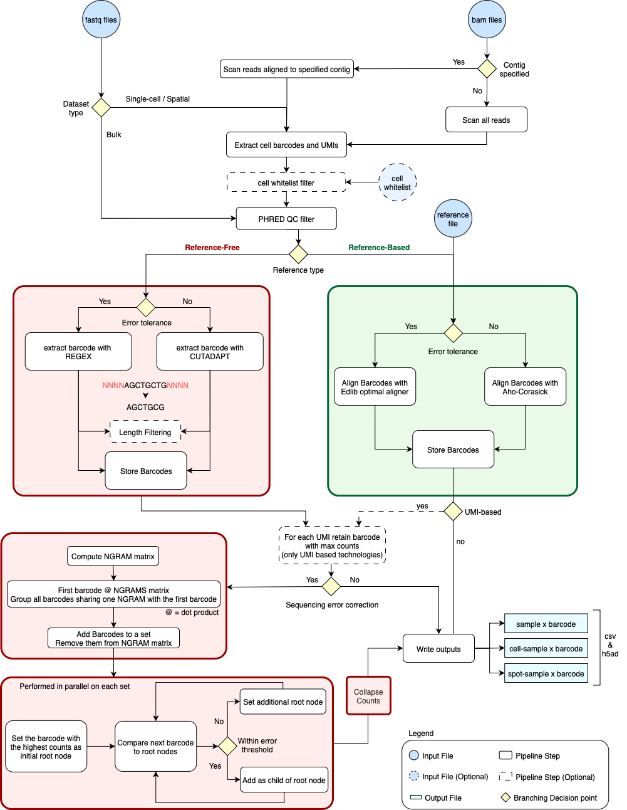

The `extract` command processes genetic barcoding data from raw sequencing files or BAM files generated by a wide array of technologies.
It requires two input files:

- **YAML Configuration File**: Specifies the parameters for the extraction process.
- **CSV Inputs File**: Defines the file paths for the sequencing data.

# **Outputs**

- Count matrices for each sample, saved separately.
- A final merged count matrix combining all samples in anndata and csv formats.

# **Usage**

On a terminal run the command as follows:

```bash
quicat extract <path_to_yaml>
```

# **Input Files**

## YAML File Example

This file specifies all the running parameters for the extract pipeline. Depending on the parameters provided, QuiCAT will either use the reference-free or reference-based workflow, enable sequencing error correction, and manage error tolerance during the extraction or alignment phases of the respective workflows.

You can find a high-level overview of the QuiCAT extract workflow and how the specified parameters guide the software’s decision-making during execution in the figure below.


```yaml
config:
  sequencing_technology: (str) "10x"
  input: (str) "bam"
  paired_end: (bool) false
  barcodes_path: (bool) false
  phred33: (bool) true
  read_qc_threshold: (int) 20
  read_qc_percentage: (int) 80
  filter_barcodes_relative_abundance: (float) 0.001
  filter_barcodes_raw_numbers: (int) null
  reference: (str) "GCTACTTGAT*ATCCTACTTG"
  contig: (str) '*'
  flanked_pattern: (bool) true
  min_read_length: (int) 40
  max_read_length: (int) 40
  read_length: (int) 40
  aln_mismatches: (int) null
  flanking_mismatches: (float) null
  left_flanking_coverage: (int) null
  right_flanking_coverage: (int) null
  distance_threshold: (int) 8
  barcode_ratio: (int) 5
  n_threads: (int) -1

input_csv: (str) "/path/to/input.csv"
output_path: (str) "/path/to/output"
```

## YAML Parameters: in-depth explanation

### config section

#### general parameters

| Parameter                   | Description                                                     | Default Value |
| --------------------------- | --------------------------------------------------------------- | ------------- |
| **`sequencing_technology`** | Technology (e.g., `"10x"`, `"Parse"`, `"DNA"`).                 | `"10x"`       |
| **`input`**                 | File format (`"fastq"` or `"bam"`).                             | `"bam"`       |
| **`paired_end`**            | Set `true` for paired-end reads (only for fastq).               | `false`       |
| **`threads`**               | Set the threads to use, default to using all available threads. | `-1`          |

#### QC thresholds

| Parameter                | Description                                              | Default Value |
| ------------------------ | -------------------------------------------------------- | ------------- |
| **`read_qc_threshold`**  | Minimum quality score.                                   | `20`          |
| **`read_qc_percentage`** | Minimum percentage of bases that meet the quality score. | `80`          |
| **`phred33`**            | Set `true` for Phred+33 or `false` for Phred+64.         | `true`        |

#### barcodes filters

| Parameter                                | Description                                                                              | Default Value |
| ---------------------------------------- | ---------------------------------------------------------------------------------------- | ------------- |
| **`filter_barcodes_relative_abundance`** | In the final count matrix only retain barcodes with relative abundance above this value. | `0.001`       |
| **`filter_barcodes_raw_numbers`**        | In the final count matrix only retain barcodes with raw count above this value.          | `null`        |

!!! note
Frequencies or raw counts intended over individual samples.

#### barcodes extraction

| Parameter                     | Description                                                                                   | Default Value |
| ----------------------------- | --------------------------------------------------------------------------------------------- | ------------- |
| **`reference`**               | Sequence for alignment (string or path to a file).                                            |               |
| **`contig`**                  | Contig to extract from BAM files (`'*'` for unmapped reads).                                  | `'*'`         |
| **`flanked_pattern`**         | `true` if the reference specify a flanked_pattern e.g. `seq1*seq2`                            | `false`       |
| **`aln_mismatches`**          | If specified in conjuction with a reference file, switch from aho-corasick to optimal aligner | `0`           |
| **`flanking_mismatches`**     | If specified in conjuction with a flanked reference, switch from regex to cutadapt            | `0.0`         |
| **`left_flanking_coverage`**  | Minimum base pairs overlap on the left flanking sequence                                      | `0`           |
| **`right_flanking_coverage`** | Minimum base pairs overlap on the right flanking sequence                                     | `0`           |
| **`flanked_pattern`**         | `true` if the reference specify a flanked_pattern e.g. `seq1*seq2`                            | `false`       |
| **`min_read_length`**         | Minimum barcode length to retain.                                                             | `null`        |
| **`max_read_length`**         | Maximum barcode length to retain.                                                             | `null`        |
| **`read_length`**             | Fixed barcode length to retain.                                                               | `null`        |

!!! note
Use `min_read_length` and `max_read_length` in combination to specify a range.

#### barcodes collapsing

| Parameter                | Description                                                                     | Default Value |
| ------------------------ | ------------------------------------------------------------------------------- | ------------- |
| **`distance_threshold`** | Distance theshold for barcode collapse. If set to 0, barcodes are not collapsed | `null`        |
| **`barcodes_ratio`**     | Minimum fold for a barcode to be collapsed into one with more counts.           | `null`        |

### I/O

| Parameter         | Description                                              | Default Value |
| ----------------- | -------------------------------------------------------- | ------------- |
| **`input_csv`**   | Path to csv file with input files paths. See below.      | `null`        |
| **`output_path`** | Path to the folder where to store the pipeline's output. | `null`        |

## CSV File Example

Specify the input files path and metadata through the input csv file. The file must have the following columns:

```csv
sample,fastq_path_r1,fastq_path_r2,barcodes_path,bam_path,condition,replicate
```

Explanation:

| Parameter           | Description                                                                                                | Notes                                           |
| ------------------- | ---------------------------------------------------------------------------------------------------------- | ----------------------------------------------- |
| **`sample`**        | Sample name as added in the final count matrix.                                                            |                                                 |
| **`fastq_path_r1`** | Path to R1 fastq file, or only fastq file if not paired end.                                               | Leave blank if using bam                        |
| **`fastq_path_r2`** | Path to R2 fastq file.                                                                                     | Leave blank if not paired end                   |
| **`barcodes_path`** | Path to `barcodes.tsv.gz` if doing (single cell or spatial only).                                          | Leave blank if no cell/spot whitelist is needed |
| **`bam_path`**      | Path to bam file.                                                                                          | Leave blank if using fastq                      |
| **`condition`**     | Specify disease or treatment status (added to final count matrix)                                          | Optional                                        |
| **`replicate`**     | If the sample is a technical replicate, specify the general sample name here (added to final count matrix) | Optional                                        |
